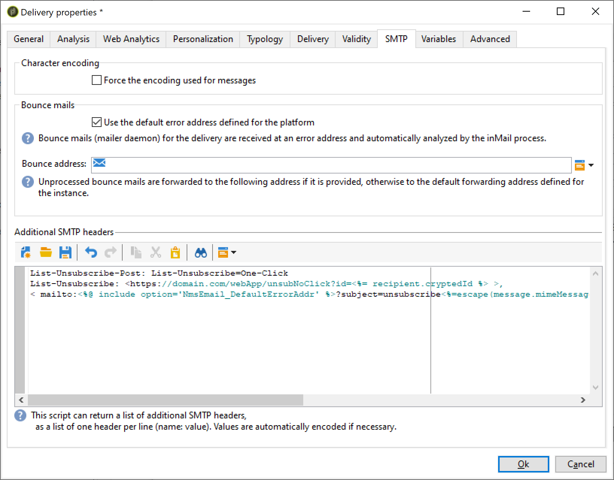
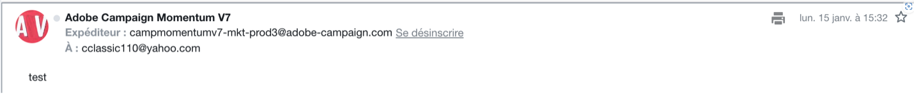

# Campaign Classic - Technische aanbevelingen {#technical-recommendations}

Hieronder vindt u een aantal technieken, configuraties en gereedschappen die u kunt gebruiken om de snelheid van uw producten te verbeteren wanneer u Adobe Campaign Classic gebruikt.

## Configuratie {#configuration}

### DNS omkeren {#reverse-dns}

Adobe Campaign controleert of omgekeerde DNS voor een IP adres wordt gegeven en dat dit correct naar IP wijst.

Een belangrijk punt in de netwerkconfiguratie zorgt ervoor dat correcte omgekeerde DNS voor elk van de IP adressen voor uitgaande berichten wordt bepaald. Dit betekent dat voor een bepaald IP adres, er een omgekeerd DNS verslag (PTR verslag) met een passende DNS (een verslag van A) die terug naar het aanvankelijke IP adres van een lus voorzien is.

De domeinkeus voor omgekeerde DNS heeft een effect wanneer het behandelen van bepaalde ISPs. AOL accepteert, met name, alleen feedbackloops met een adres in hetzelfde domein als de omgekeerde DNS (zie [Feedbacklus](#feedback-loop)).

>[!NOTE]
>
>U kunt [dit externe gereedschap](https://mxtoolbox.com/SuperTool.aspx) om de configuratie van een domein te verifiëren.

### MX-regels {#mx-rules}

MX-regels (Mail eXchanger) zijn de regels die de communicatie tussen een verzendende server en een ontvangende server beheren.

Meer bepaald, worden zij gebruikt om de snelheid te controleren waarbij Adobe Campaign MTA (de Agent van de Overdracht van het Bericht) e-mails naar elk individueel e-maildomein of ISP (bijvoorbeeld, hotmail.com, comcast.net) verzendt. Deze regels zijn typisch gebaseerd op grenzen die door ISPs worden gepubliceerd (bijvoorbeeld, omvatten niet meer dan 20 berichten per elke verbinding SMTP).

>[!NOTE]
>
>Voor meer informatie over MX-beheer in Adobe Campaign Classic raadpleegt u [deze sectie](https://experienceleague.adobe.com/docs/campaign-classic/using/installing-campaign-classic/additional-configurations/email-deliverability.html#mx-configuration).

### TLS {#tls}

TLS (Transport Layer Security) is een versleutelingsprotocol dat kan worden gebruikt om de verbinding tussen twee e-mailservers te beveiligen en de inhoud van een e-mailbericht te beschermen tegen lezen door andere personen dan de beoogde ontvangers.

### Domein van afzender {#sender-domain}

Als u het domein wilt definiëren dat wordt gebruikt voor de opdracht HELO, bewerkt u het configuratiebestand van de instantie (conf/config-instance.xml) en definieert u als volgt een kenmerk &quot;localDomain&quot;:

```
<serverConf>
  <shared>
    <dnsConfig localDomain="mydomain.net"/>
  </shared>
</serverConf>
```

MAIL VAN domein is het domein dat in technische stuitberichten wordt gebruikt. Dit adres wordt gedefinieerd in de implementatietovenaar of via de optie NmsEmail_DefaultErrorAddr.

### SPF-record {#dns-configuration}

Een SPF-record kan momenteel op een DNS-server worden gedefinieerd als een TXT-typerecord (code 16) of een SPF-typerecord (code 99). Een SPF-record heeft de vorm van een tekenreeks. Bijvoorbeeld:

```
v=spf1 ip4:12.34.56.78/32 ip4:12.34.56.79/32 ~all
```

bepaalt de twee IP adressen, 12.34.56.78 en 12.34.56.79, zoals gemachtigd om e-mails voor het domein te verzenden. **~all** betekent dat elk ander adres moet worden geïnterpreteerd als een SoftFail.

Recommendations voor het definiëren van een SPF-record:

* Toevoegen **~all** (SoftFail) of **-all** (Mislukt) aan het einde om alle andere servers dan de gedefinieerde te weigeren. Zonder dit, zullen de servers dit domein (met een Neutrale evaluatie) kunnen vervalsen.
* Niet toevoegen **ptr** (openspf.org beveelt aan dit als kostbaar en onbetrouwbaar te verhelpen).

>[!NOTE]
>
>Meer informatie over SPF in [deze sectie](/help/additional-resources/authentication.md#spf).

## Verificatie

>[!NOTE]
>
>Meer informatie over de verschillende vormen van e-mailverificatie vindt u in [deze sectie](/help/additional-resources/authentication.md).

### DKIM {#dkim-acc}

>[!NOTE]
>
>Voor gehoste of hybride installaties, als u een upgrade hebt uitgevoerd naar de [Enhanced MTA](https://experienceleague.adobe.com/docs/campaign-classic/using/sending-messages/sending-emails/sending-an-email/sending-with-enhanced-mta.html#sending-messages), DKIM ondertekenen van e-mailverificatie wordt uitgevoerd door de Enhanced MTA voor alle berichten met alle domeinen.

Gebruiken [DKIM](/help/additional-resources/authentication.md#dkim) met Adobe Campaign Classic is de volgende voorwaarde vereist:

**Adobe Campaign-optiedeclaratie**: in Adobe Campaign is de persoonlijke sleutel DKIM gebaseerd op een DKIM-kiezer en een domein. Het is momenteel niet mogelijk om meerdere persoonlijke sleutels voor hetzelfde domein of subdomein te maken met verschillende kiezers. Het is niet mogelijk om te bepalen welk selecteerdomein/subdomein voor de authentificatie in noch het platform noch e-mail moet worden gebruikt. Het platform zal alternatief één van de privé sleutels selecteren, wat betekent de authentificatie een hoge kans heeft om te ontbreken.

* Als u DomainKeys voor uw instantie van Adobe Campaign hebt gevormd, moet u enkel selecteren **dkim** in de [Regels voor domeinbeheer](https://experienceleague.adobe.com/docs/campaign-classic/using/sending-messages/monitoring-deliveries/understanding-delivery-failures.html#email-management-rules). Indien niet, volg de zelfde configuratiestappen (privé/openbare sleutel) zoals voor DomainKeys (die DKIM verving).
* Het is niet noodzakelijk om zowel DomainKeys als DKIM voor het zelfde domein toe te laten aangezien DKIM een betere versie van DomainKeys is.
* De volgende domeinen valideren momenteel DKIM: AOL, Gmail.

## Feedbacklus {#feedback-loop-acc}

Een feedbacklijn werkt door op het ISP niveau een bepaald e-mailadres voor een waaier van IP adressen te verklaren die voor het verzenden van berichten worden gebruikt. ISP zal naar deze brievenbus, op een gelijkaardige manier verzenden zoals wat voor stuitberichten wordt gedaan, die berichten die door ontvangers als spam worden gemeld. Het platform moet zo worden geconfigureerd dat toekomstige leveringen aan gebruikers die een klacht hebben ingediend, worden geblokkeerd. Het is belangrijk dat zij niet langer contact met hen opnemen, ook al hebben zij niet de juiste opt-out-link gebruikt. Het is gebaseerd op deze klachten dat ISP een IP adres aan zijn lijst van gewezen personen zal toevoegen. Afhankelijk van ISP, zal een klachtentarief van rond 1% in het blokkeren van een IP adres resulteren.

Er wordt momenteel een standaard ontwikkeld voor het definiëren van de indeling van feedbacklusberichten: de [Misbruikrapportage-indeling (ARF)](https://tools.ietf.org/html/rfc6650).

Het implementeren van een feedbacklus voor een instantie vereist:

* Een brievenbus specifiek aan de instantie, die de stuiterende brievenbus kan zijn
* IP die adressen verzendt specifiek aan de instantie

Bij het implementeren van een eenvoudige feedbacklus in Adobe Campaign wordt de functionaliteit voor het stuiterende bericht gebruikt. De terugkoppelt lijnbrievenbus wordt gebruikt als stuiterende brievenbus en een regel wordt bepaald om deze berichten te ontdekken. De e-mailadressen van de ontvangers die het bericht als spam hebben gemeld, worden toegevoegd aan de quarantainelijst.

* Een stuiterende mailregel maken of wijzigen **Feedback_loop**, in **[!UICONTROL Administration > Campaign Management > Non deliverables Management > Mail rule sets]** om welke reden **Geweigerd** en het type **Hard**.
* Als een brievenbus speciaal voor de terugkoppel lijn is bepaald, bepaal de parameters om tot het toegang te hebben door een nieuwe externe rekening van de Steekproef te creëren Mails in **[!UICONTROL Administration > Platform > External accounts]**.

Het mechanisme is onmiddellijk operationeel voor het verwerken van kennisgevingen van klachten. Om ervoor te zorgen deze regel correct werkt, kunt u de rekeningen tijdelijk deactiveren zodat zij deze berichten niet verzamelen, dan controleren de inhoud van terugkoppelt lijnbrievenbus manueel. Voer op de server de volgende opdrachten uit:

```
nlserver stop inMail@instance,
nlserver inMail -instance:instance -verbose.
```

Als u gedwongen bent om één enkel te gebruiken terugkoppelt lijnadres voor veelvoudige instanties, moet u:

* Herhaal de ontvangen berichten op zo veel brievenbussen aangezien er instanties zijn,
* Heb elke brievenbus die door één enkele instantie wordt opgepakt,
* Vorm de instanties zodat zij slechts de berichten verwerken die hen aangaan: de instantieinformatie is inbegrepen in de bericht-identiteitskaart- kopbal van berichten die door Adobe Campaign worden verzonden en daarom ook in de terugkoppel lusberichten wordt gevestigd. Geef de opdracht **checkInstanceName** parameter in het dossier van de instantieconfiguratie (door gebrek, wordt de instantie niet geverifieerd en dit kan bepaald adres ertoe leiden om verkeerd in quarantined te zijn):

  ```
  <serverConf>
    <inMail checkInstanceName="true"/>
  </serverConf>
  ```

Met de Adobe Campaign-service voor leveringszekerheid wordt uw abonnement op feedbacklusservices beheerd voor de volgende ISP&#39;s: AOL, BlueTime, Comcast, Cox, EarthLink, FastMail, Gmail, Hotmail, HostedEmail, Libero, Mail.ru, MailTrust, OpenSRS, QQ, RoadRunner, Synacor, Telenor, Terra, UnitedOnline, USA, XS4ALL Yahoo, Yandex, Zoho.

## List-Unsubscribe {#list-unsubscribe}

Een SMTP-header toevoegen met de naam **List-Unsubscribe** is verplicht om een optimaal beheer van de leverbaarbaarheid te waarborgen.

Deze kopbal kan als alternatief aan het &quot;Rapport als SPAM&quot;pictogram worden gebruikt. Het toont als &quot;Unsubscribe&quot;verbinding in de ISPs e-mailinterfaces.

Met deze functionaliteit verlaagt u de klachtenkosten en helpt u uw reputatie te beschermen. Feedback wordt uitgevoerd als een abonnement.

Gmail, Outlook.com, Yahoo! en Microsoft Outlook ondersteunen deze methode. Een &quot;Unsubscribe&quot;verbinding is beschikbaar direct in hun interface. Bijvoorbeeld:


>[!NOTE]
>
>De koppeling Afmelden wordt mogelijk niet altijd weergegeven. Het kan zelfs van de specifieke criteria en het beleid van elke ISP afhangen. Daarom zorg ervoor uw berichten door een afzender worden verzonden:
>
>* Met goede reputatie
>* Onder de drempel van de spamklacht van ISPs
>* Volledig geverifieerd

Twee versies van de List-Unsubscribe kopbalfunctionaliteit bestaan:

* **&quot;mailto&quot; List-Unsubscribe** - Klik met deze methode op de knop **Abonnement opzeggen** Hiermee wordt een vooraf ingevulde e-mail verzonden naar het afmeldingsadres dat in de e-mailheader is opgegeven. [Meer informatie](#mailto-list-unsubscribe)

* **List-Unsubscribe van &quot;One-Click&quot;** - Klik met deze methode op de knop **Abonnement opzeggen** de verbinding maakt direct ondertekent de gebruiker. [Meer informatie](#one-click-list-unsubscribe)

>[!NOTE]
>
>Vanaf 1 juni 2024 zullen belangrijke ISP&#39;s van afzenders eisen dat ze voldoen aan **Een-klik List-Unsubscribe**.

### &quot;mailto&quot; List-Unsubscribe {#mailto-list-unsubscribe}

Met deze methode klikt u op de knop **Abonnement opzeggen** Hiermee wordt een vooraf ingevulde e-mail verzonden naar het afmeldingsadres dat in de e-mailheader is opgegeven.

Als u een &quot;mailto&quot;-abonnement wilt gebruiken, moet u een opdrachtregel invoeren waar u een e-mailadres opgeeft, zoals: `List-Unsubscribe: <mailto:client@newsletter.example.com?subject=unsubscribe?body=unsubscribe>`

>[!CAUTION]
>
>Het bovenstaande voorbeeld is gebaseerd op de tabel met ontvangers. Als de gegevensbestandimplementatie van een andere lijst wordt gedaan, zorg ervoor om de bevellijn met de correcte informatie te herformuleren.

U kunt een dynamische &quot;mailto&quot;lijst-Unsubscript ook tot stand brengen gebruikend een bevellijn zoals: `List-Unsubscribe: <mailto:<%=errorAddress%>?subject=unsubscribe%=message.mimeMessageId%>`

Om **&quot;mailto&quot; List-Unsubscribe** in Campaign kunt u:

* Voeg direct de bevellijn in het levering of leveringsmalplaatje toe - [Meer informatie](#adding-a-command-line-in-a-delivery-template)

* Een typologieregel maken - [Meer informatie](#creating-a-typology-rule)

#### Een opdrachtregel toevoegen in een levering of sjabloon {#adding-a-command-line-in-a-delivery-template}

De opdrachtregel moet worden toegevoegd aan de **[!UICONTROL Additional SMTP headers]** van de SMTP-header van de e-mail.

Deze toevoeging kan in elke e-mail, of in bestaande leveringsmalplaatjes worden gedaan. U kunt ook een nieuwe leveringssjabloon maken die deze functionaliteit bevat.

Typ bijvoorbeeld het volgende script in het dialoogvenster **[!UICONTROL Additional SMTP headers]** veld: `List-Unsubscribe: mailto:unsubscribe@domain.com`. Klik op de knop **afmelden** via de koppeling wordt een e-mail naar het adres unsubscribe@domain.com verzonden.

U kunt ook een dynamisch adres gebruiken. Als u bijvoorbeeld een e-mail wilt verzenden naar het opgegeven foutadres voor het platform, kunt u het volgende script gebruiken: `List-Unsubscribe: <mailto:<%=errorAddress%>?subject=unsubscribe%=message.mimeMessageId%>`


#### Een typologieregel maken {#creating-a-typology-rule}

De regel moet het manuscript bevatten dat de bevellijn produceert en het moet in de e-mailkopbal worden omvat.

Leer hoe u typologische regels maakt in Adobe Campaign v7/v8 in [deze sectie](https://experienceleague.adobe.com/docs/campaign-classic/using/orchestrating-campaigns/campaign-optimization/about-campaign-typologies.html#typology-rules).

>[!NOTE]
>
>We raden u aan een typologieregel te maken: de functionaliteit List-Unsubscribe wordt automatisch toegevoegd aan elke e-mail met deze typologieregel.

### Een-klik List-Unsubscribe {#one-click-list-unsubscribe}

Met deze methode klikt u op de knop **Abonnement opzeggen** de verbinding maakt direct de gebruiker af, die slechts één enkele actie vereist om zich af te melden.

Vanaf 1 juni 2024 zullen belangrijke ISP&#39;s van afzenders eisen dat ze voldoen aan **Een-klik List-Unsubscribe**.

Om aan deze eis te voldoen, moeten de afzenders:

* Voeg de volgende opdrachtregel toe: `List-Unsubscribe-Post: List-Unsubscribe=One-Click`.
* Voeg een URI-afmeldingskoppeling toe.
* De ontvangst van de reactie van de POST van HTTP van de ontvanger steunen, die Adobe Campaign steunt. U kunt ook een externe service gebruiken.

Als u de reactie van de POST List-Unsubscribe met één klik rechtstreeks in Adobe Campaign v7/v8 wilt ondersteunen, moet u deze toevoegen in de webtoepassing &quot;Niet-actieve ontvangers opzeggen&quot;. Dit doet u als volgt:

1. Ga naar **[!UICONTROL Resources]** > **[!UICONTROL Online]** > **[!UICONTROL Web applications]**.

1. Upload &quot;Ontvangers zonder klik afmelden&quot; [XML](/help/assets/WebAppUnsubNoClick.xml.zip) bestand.

Om te vormen **Een-klik List-Unsubscribe** in Campaign kunt u:

* Voeg de bevellijn in het levering of leveringsmalplaatje toe - [Meer informatie](#one-click-delivery-template)
* Een typologieregel maken - [Meer informatie](#one-click-typology-rule)

#### Het vormen van lijst-Signaal van één-Klik in de levering of het malplaatje {#one-click-delivery-template}

Volg onderstaande stappen om een-klik lijst-Unsubscribe in het levering of leveringsmalplaatje te vormen.

1. Ga naar de **[!UICONTROL SMTP]** van de leveringseigenschappen.

1. Onder **[!UICONTROL Additional SMTP Headers]** Voer de opdrachtregels in, zoals in het onderstaande voorbeeld. Elke koptekst moet op een aparte regel staan.

Bijvoorbeeld:

```
List-Unsubscribe-Post: List-Unsubscribe=One-Click
List-Unsubscribe: <https://domain.com/webApp/unsubNoClick?id=<%= recipient.cryptedId %> >, < mailto:<%@ include option='NmsEmail_DefaultErrorAddr' %>?subject=unsubscribe<%=escape(message.mimeMessageId) %> >
```



In het bovenstaande voorbeeld wordt een List-Unsubscribe (Engelstalig) met één klik ingeschakeld voor ISP&#39;s die One-Click ondersteunen, terwijl tegelijkertijd wordt gegarandeerd dat ontvangers die &quot;mailto&quot; niet ondersteunen, nog steeds kunnen vragen om hun abonnement op te zeggen via e-mail.

#### Het creëren van een typologieregel om lijst-Unsubscript met één klik te steunen {#one-click-typology-rule}

Volg onderstaande stappen om een-klik lijst-Unsubscribe te vormen gebruikend een typologieregel.

1. Ga vanuit de navigatiestructuur naar **[!UICONTROL Typolgy rules]** en klik op **[!UICONTROL New]**.

   


1. Vorm de nieuwe typologieregel zoals:

   * **[!UICONTROL Rule type]**: **[!UICONTROL Control]**
   * **[!UICONTROL Phase]**: **[!UICONTROL At the start of targeting]**
   * **[!UICONTROL Channel]**: **[!UICONTROL Email]**
   * **[!UICONTROL Level]**: uw keuze
   * **[!UICONTROL Active]**


   

1. Codeer javascript van de typologieregel zoals in het onderstaande voorbeeld.

   >[!NOTE]
   >
   >De hieronder beschreven code moet alleen als voorbeeld worden gebruikt.

   In dit voorbeeld wordt beschreven hoe u:
   * Vorm een &quot;mailto&quot;lijst-Unsubscribe. De headers worden toegevoegd of de bestaande &quot;mailto:&quot;-parameters toegevoegd en vervangen door: &lt;mailto..>>, https://...
   * Voeg toe in de lijst-Unsubscribe kopbal met één klik. Gebruikt `var headerUnsubUrl = "https://campmomentumv7-mkt-prod3.campaign.adobe.com/webApp/unsubNoClick?id=<%= recipient.cryptedId %>"÷`

   >[!NOTE]
   >
   >U kunt andere parameters toevoegen (zoals &amp;service =...).

   ```
   // Function to add or replace a header in the provided headers 
   function addHeader(headers, header, value)  { 
       
     // Create the new header line 
     var headerLine = header + ": " + value; 
       
     // Create a regular expression to find the specified header 
     var regExp = new RegExp(header + ":(.*)$", "i") 
       
     // Split the headers into individual lines 
     var headerLines = headers.split("\n"); 
       
     // Loop through each line 
     for (var i=0; i < headerLines.length; i++) { 
         
       // Check if the specified header exists 
       var match = headerLines[i].match(regExp) 
         
       // If it exists 
       if ( match != null ) { 
           
         // Replace the existing header line 
         headerLines[i] = headerLine; 
           
         // Return the modified headers 
         return headerLines.join("\n"); 
       } 
     } 
       
     // If the header does not exist, add the new header line 
     headerLines.push(headerLine); 
       
     // Return the modified headers 
     return headerLines.join("\n"); 
   } 
     
   // Function to get the value of a specified header from the provided headers 
   function getHeader(headers, header) { 
       
     // Create a regular expression to find the specified header 
     var regExp = new RegExp(header + ":(.*)$", "i") 
       
     // Split the headers into individual lines 
     var headerLines = headers.split("\n"); 
       
     // Loop each line 
     for each (line in headerLines) { 
         
       // Check if the specified header exists 
       var match = line.match(regExp); 
         
       // If it exists 
       if ( match != null ) { 
           
         // Return the header value, removing leading whitespace 
         return match[1].replace(/^\s*/, ""); 
       } 
     } 
       
     // If the header does not exist, return an empty string 
     return ""; 
   } 
     
     
   // Define the unsubscribe URL 
   var headerUnsubUrl = "https://campmomentumv7-mkt-prod3.campaign.adobe.com/webApp/unsubNoClick?id=<%= recipient.cryptedId %>"; 
     
   // Get the value of the List-Unsubscribe header 
   var headerUnsub = getHeader(delivery.mailParameters.headers, "List-Unsubscribe"); 
     
   // If the List-Unsubscribe header does not exist 
   if ( headerUnsub === "" ) { 
     // Add the List-Unsubscribe header 
     delivery.mailParameters.headers = addHeader(delivery.mailParameters.headers, "List-Unsubscribe", "<"+headerUnsubUrl+">"); 
   } 
   // If the List-Unsubscribe header exists and contains 'mailto' 
   else if(headerUnsub.search('mailto')){ 
     // Replace the existing List-Unsubscribe header 
     delivery.mailParameters.headers = addHeader(delivery.mailParameters.headers, "List-Unsubscribe", "<"+headerUnsubUrl+">"); 
   } 
     
   // Get the value of the List-Unsubscribe-Post header 
   var headerUnsubPost = getHeader(delivery.mailParameters.headers, "List-Unsubscribe-Post"); 
     
   // If the List-Unsubscribe-Post header does not exist 
   if ( headerUnsubPost === "" ) { 
     // Add the List-Unsubscribe-Post header 
     delivery.mailParameters.headers = addHeader(delivery.mailParameters.headers, "List-Unsubscribe-Post", "List-Unsubscribe=One-Click"); 
   } 
     
   // Return true to indicate success 
   return true; 
   ```


   

1. Voeg uw nieuwe regel toe aan een typologie die van toepassing is op e-mails.

   >[!NOTE]
   >
   >U kunt deze toevoegen aan de standaardtypologie.

   

1. Bereid een nieuwe levering voor.

   >[!CAUTION]
   >
   >Controleer of de **[!UICONTROL Additional SMTP headers]** veld in de leveringseigenschappen is leeg.

   

1. Controleer tijdens de voorbereiding van de levering of uw nieuwe typologieregel is toegepast.

   

1. Controleer of de koppeling Abonnement opzeggen aanwezig is.

   

## E-mailoptimalisatie {#email-optimization}

### SMTP {#smtp}

SMTP (Simple Mail Transfer Protocol) is een internetstandaard voor e-mailverzending.

De fouten SMTP die niet door een regel worden gecontroleerd zijn vermeld in **[!UICONTROL Administration]** > **[!UICONTROL Campaign Management]** > **[!UICONTROL Non deliverables Management]** > **[!UICONTROL Delivery log qualification]** map. Deze foutberichten worden standaard geïnterpreteerd als onbereikbare schermfouten.

De meest voorkomende fouten moeten worden geïdentificeerd en er moet een corresponderende regel aan worden toegevoegd **[!UICONTROL Administration]** > **[!UICONTROL Campaign Management]** > **[!UICONTROL Non deliverables Management]** > **[!UICONTROL Mail rule sets]** als u wenst om correct te kwalificeren terugkoppelt van de servers SMTP. Zonder deze methode zal het platform onnodige herhalingen (bij onbekende gebruikers) uitvoeren of ten onrechte bepaalde ontvangers in quarantaine plaatsen na een bepaald aantal tests.

### Specifieke IPs {#dedicated-ips}

De Adobe verstrekt een specifieke IP strategie voor elke klant van een oprijplaat-omhoog IP om een reputatie te bouwen en leveringsprestaties te optimaliseren.
